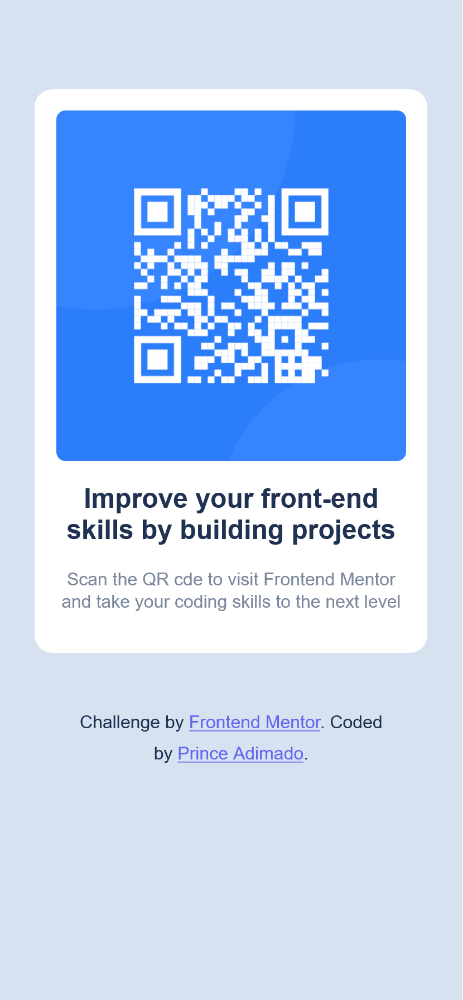

# Frontend Mentor - QR code component solution

This is a solution to the [QR code component challenge on Frontend Mentor](https://www.frontendmentor.io/challenges/qr-code-component-iux_sIO_H). Frontend Mentor challenges help you improve your coding skills by building realistic projects. 

## Table of contents

- [Overview](#overview)
  - [Screenshot](#screenshot)
  - [Links](#links)
- [My process](#my-process)
  - [Built with](#built-with)
  - [What I learned](#what-i-learned)
  - [Continued development](#continued-development)
  - [Useful resources](#useful-resources)
- [Author](#author)

**Note: Delete this note and update the table of contents based on what sections you keep.**

## Overview

### Screenshot




### Links

- Solution URL: [Add solution URL here](https://your-solution-url.com)
- Live Site URL: [Add live site URL here](https://your-live-site-url.com)

## My process

### Built with

- Semantic HTML5 markup
- CSS custom properties
- Flexbox
- [Tailwind CSS](https://tailwindcss.com/) - CSS Library


### What I learned

I knew Tailwind CSS is very cool but in my first try I didn't understand, which was months ago. So after I got a grip of CSS and HTML, I tried again and it was very easy to use. I'm very happy with the result.

```html
<div class="flex flex-col justify-center items-center h-screen">
    <div class="w-80 h-80">
        <div class="bg-black w-full h-full rounded-md"></div>
    </div>
    <div class="w-80 h-80">
        <div class="bg-white w-full h-full rounded-md"></div>
    </div>
</div>
```

```css
.bg-black {
    @apply bg-black;
}

.bg-white {
    @apply bg-white;
}
```

#### Continued development

I'm thinking about using Tailwind CSS in my next projects, because it's very easy to use and I like the result.

#### Useful resources

- [Tailwind CSS](https://tailwindcss.com/) - This helped me for the CSS. I really liked this pattern and will use it going forward.

**Note: Delete this note and replace the list above with resources that helped you during the challenge. These could come in handy for anyone viewing your solution or for yourself when you look back on this project in the future.**

## Author

- Website - [Prince Adimado](https://primado-mlsa-site.netlify.app/)
- Frontend Mentor - [@primado](https://www.frontendmentor.io/profile/prince-adimado-105)
- Twitter - [@_primado](https://www.twitter.com/_primado)


[]: # Path: README.md
# Frontend Mentor - QR code component solution

This is a solution to the [QR code component challenge on Frontend Mentor](https://www.frontendmentor.io/challenges/qr-code-component-iux

To see how you can add code snippets, see below:

```html
<h1>Some HTML code I'm proud of</h1>
```
```css
.proud-of-this-css {
  color: papayawhip;
}
```
```js
const proudOfThisFunc = () => {
  console.log('🎉')
}
```

If you want more help with writing markdown, we'd recommend checking out [The Markdown Guide](https://www.markdownguide.org/) to learn more.

**Note: Delete this note and the content within this section and replace with your own learnings.**

### Continued development

Use this section to outline areas that you want to continue focusing on in future projects. These could be concepts you're still not completely comfortable with or techniques you found useful that you want to refine and perfect.

**Note: Delete this note and the content within this section and replace with your own plans for continued development.**

### Useful resources

- [Tailwind CSS Docs](https://www.tailwindcss.com) - The Tailwind CSS docs are a great resource to learn about the utility classes and how to use them. 

**Note: Delete this note and replace the list above with resources that helped you during the challenge. These could come in handy for anyone viewing your solution or for yourself when you look back on this project in the future.**

## Author

- Website - [Prince Adimado](https://primado-mlsa-site.netlify.app/)
- Frontend Mentor - [@primado](https://www.frontendmentor.io/profile/prince-adimado-105)
- Twitter - [@_primado](https://www.twitter.com/_primado)

[]: # Path: README.md
# Frontend Mentor - QR code component solution

This is a solution to the [QR code component challenge on Frontend Mentor](https://www.frontendmentor.io/challenges/qr-code-component-iux_sIO_H). Frontend Mentor challenges help you improve your coding skills by building realistic projects. 

## Table of contents

- [Overview](#overview)
  - [Screenshot](#screenshot)
  - [Links](#links)
- [My process](#my-process)
  - [Built with](#built-with)
  - [What I learned](#what-i-learned)
  - [Continued development](#continued-development)
  - [Useful resources](#useful-resources)
- [Author](#author)

**Note: Delete this note and update the table of contents based on what sections you keep.**

## Overview

### Screenshot


### Links

- Solution URL: [Add solution URL here](https://your-solution-url.com)
- Live Site URL: [Add live site URL here](https://your-live-site-url.com)

## My process

### Built with

- Semantic HTML5 markup
- CSS custom properties
- Flexbox
- [Tailwind CSS](https://tailwindcss.com/) - CSS Library

**Note: Delete this note and replace the list above with resources that helped you during the challenge. These could come in handy for anyone viewing your solution or for yourself when you look back on this project in the future.**

## Author

- Website - [Add your name here](https://www.your-site.com)
- Frontend Mentor - [@yourusername](https://www.frontendmentor.io/profile/yourusername)
- Twitter - [@yourusername](https://www.twitter.com/yourusername)


# QR Code Generator

This project is from a challenge on Frontend Mentor dot com.
I had already created this project before. But this around I wanted to
get started with TailWind CSS so I decided to give this project a try again
do it better.


## Demo

Link to the site.

https://qr-code-compo-002.netlify.app/
## Challenge 
Chalenge from 
https://frontendmentor.com/

Link to Chalenge
https://www.frontendmentor.io/challenges/qr-code-component-iux_sIO_H
